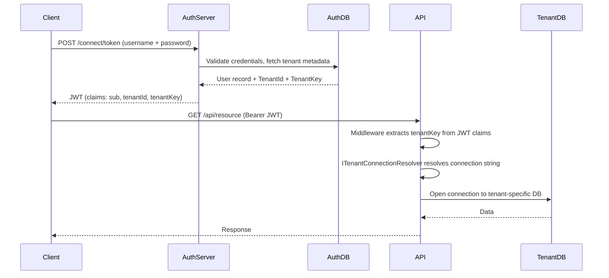
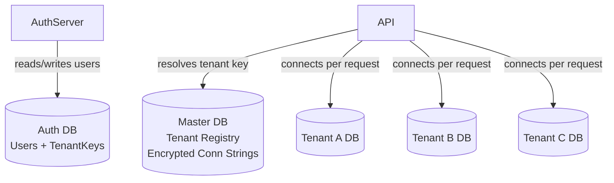

# Multi-Tenancy in .NET with Separate Auth Server

## The Core Problem

You have two concerns:

1. An **auth server** (e.g. Duende IdentityServer / Keycloak) with its own DB, where the user is created along with their **tenant connection string**
2. Your **API/application** needs to resolve the correct tenant DB at runtime, per request

-----

## The Architecture

### Request Flow



### Database Architecture



-----

## Implementation

### 1. Auth Server — Storing Tenant Info on the User

When registering a user, store tenant metadata in your **auth DB**. Do not store the raw connection string — store a `tenantKey` that resolves server-side on the API.

```csharp
// Extend IdentityUser with tenant metadata
public class TenantUser : IdentityUser
{
    public string TenantId { get; set; }
    public string TenantKey { get; set; } // opaque key, not the raw connection string
}
```

Embed `tenantId` and `tenantKey` as **custom claims** in the JWT via a profile service:

```csharp
// Custom profile service (Duende / IdentityServer)
public class TenantProfileService : IProfileService
{
    private readonly UserManager<TenantUser> _userManager;

    public TenantProfileService(UserManager<TenantUser> userManager)
    {
        _userManager = userManager;
    }

    public async Task GetProfileDataAsync(ProfileDataRequestContext context)
    {
        var user = await _userManager.GetUserAsync(context.Subject);

        context.IssuedClaims.AddRange(new[]
        {
            new Claim("tenant_id", user.TenantId),
            new Claim("tenant_key", user.TenantKey)
        });
    }

    public async Task IsActiveAsync(IsActiveContext context)
    {
        var user = await _userManager.GetUserAsync(context.Subject);
        context.IsActive = user is not null;
    }
}
```

> **Rule:** Never put the raw connection string in the JWT. The JWT is client-visible (base64 decoded). Store a `tenantKey` and resolve the real connection string server-side on every request.

-----

### 2. API — Tenant Context Abstraction

```csharp
// Represents the resolved tenant for the current request
public interface ITenantContext
{
    string TenantId { get; }
    string ConnectionString { get; }
}

public class TenantContext : ITenantContext
{
    public string TenantId { get; set; }
    public string ConnectionString { get; set; }
}
```

-----

### 3. API — Tenant Resolution Middleware

```csharp
public class TenantResolutionMiddleware
{
    private readonly RequestDelegate _next;

    public TenantResolutionMiddleware(RequestDelegate next) => _next = next;

    public async Task InvokeAsync(
        HttpContext context,
        ITenantConnectionResolver resolver)
    {
        var tenantKey = context.User.FindFirst("tenant_key")?.Value;

        if (tenantKey is not null)
        {
            var tenantContext = await resolver.ResolveAsync(tenantKey);
            context.Items["TenantContext"] = tenantContext;
        }

        await _next(context);
    }
}
```

Register it in `Program.cs` **after** `UseAuthentication`:

```csharp
app.UseAuthentication();
app.UseAuthorization();
app.UseMiddleware<TenantResolutionMiddleware>(); // after auth so User is populated
```

-----

### 4. API — Connection Resolver

The resolver looks up the actual connection string from a central **master DB**. Two options:

**Option A: Direct DB lookup**

```csharp
public class TenantConnectionResolver : ITenantConnectionResolver
{
    private readonly MasterDbContext _masterDb;
    private readonly IEncryptionService _encryption;

    public TenantConnectionResolver(
        MasterDbContext masterDb,
        IEncryptionService encryption)
    {
        _masterDb = masterDb;
        _encryption = encryption;
    }

    public async Task<TenantContext> ResolveAsync(string tenantKey)
    {
        var tenant = await _masterDb.Tenants
            .FirstOrDefaultAsync(t => t.Key == tenantKey)
            ?? throw new InvalidOperationException($"Tenant '{tenantKey}' not found.");

        return new TenantContext
        {
            TenantId = tenant.Id,
            ConnectionString = _encryption.Decrypt(tenant.EncryptedConnectionString)
        };
    }
}
```

**Option B: Cached lookup (recommended for performance)**

```csharp
public class CachedTenantConnectionResolver : ITenantConnectionResolver
{
    private readonly IMemoryCache _cache;
    private readonly MasterDbContext _masterDb;
    private readonly IEncryptionService _encryption;

    public async Task<TenantContext> ResolveAsync(string tenantKey)
    {
        return await _cache.GetOrCreateAsync($"tenant:{tenantKey}", async entry =>
        {
            entry.AbsoluteExpirationRelativeToNow = TimeSpan.FromMinutes(10);

            var tenant = await _masterDb.Tenants
                .FirstAsync(t => t.Key == tenantKey);

            return new TenantContext
            {
                TenantId = tenant.Id,
                ConnectionString = _encryption.Decrypt(tenant.EncryptedConnectionString)
            };
        });
    }
}
```

> Use Redis instead of `IMemoryCache` if you’re running multiple API instances.

-----

### 5. API — Injecting the Tenant DbContext

Register `ITenantContext` and `AppDbContext` as **scoped** so each request gets the correct connection:

```csharp
// Program.cs

builder.Services.AddScoped<ITenantConnectionResolver, CachedTenantConnectionResolver>();

builder.Services.AddScoped<ITenantContext>(sp =>
{
    var httpContext = sp.GetRequiredService<IHttpContextAccessor>().HttpContext;
    return httpContext?.Items["TenantContext"] as ITenantContext
        ?? throw new InvalidOperationException("Tenant context not resolved.");
});

builder.Services.AddDbContext<AppDbContext>((sp, options) =>
{
    var tenant = sp.GetRequiredService<ITenantContext>();
    options.UseSqlServer(tenant.ConnectionString);
});
```

Your controllers and services can then inject `AppDbContext` normally — it will always be scoped to the correct tenant DB for that request.

-----

## Key Design Decisions

|Concern                           |Recommendation                                          |
|----------------------------------|--------------------------------------------------------|
|Connection string in JWT?         |No — use a `tenantKey`, resolve server-side             |
|Where to store connection strings?|Master DB, AES-encrypted (+ Azure Key Vault for the key)|
|Performance?                      |Cache resolved tenant contexts (IMemoryCache or Redis)  |
|DbContext lifetime?               |`Scoped` — new connection string resolved per request   |
|Auth server DB?                   |Completely separate from tenant DBs and the master DB   |
|Multiple API instances?           |Replace IMemoryCache with IDistributedCache (Redis)     |

-----

## Summary

The auth server is only responsible for **authenticating the user and asserting their tenant identity** via JWT claims. The actual connection string resolution happens on the API side, triggered by the `tenant_key` claim. This keeps the auth server lean, the JWT safe, and tenant logic encapsulated where it belongs.